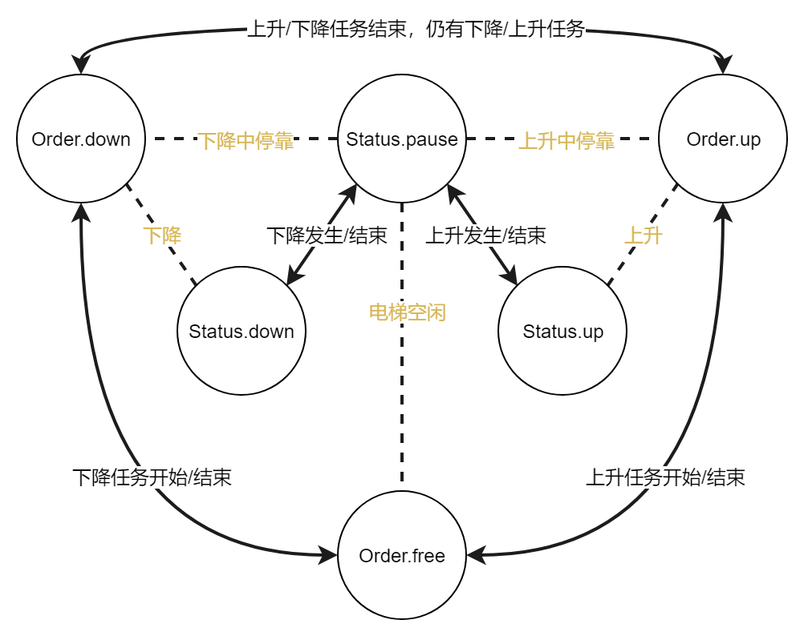

# Elevator-Dispatch
电梯调度，操作系统课程作业

## 1. elevator_demo

调度算法的命令行验证

## 2. elevator_WasteCase

使用1中的调度算法，建立图形界面

### 一些特点

1. 电梯内部可以两次按动楼层按钮，以取消该楼层的调度。
2. 由于设计缺陷，在某些极端情况下，在电梯外部按动上或下按钮可能没有响应。因此废案。

### 调度原理

电梯具有三个属性：state，order和job

1. state：指示电梯当前的`运行状态`
2. order：指示电梯当前的`指令`
3. job：指示电梯当前的`任务`

说明：

1. 运行状态包含向上运动、向下运动以及停靠
2. 指令包含向上运动、向下运动以及无指令
3. 任务包含向上运动、向下运动以及无任务

其中，运行状态和指令具有一定的组合关系，原理图如下

实体箭头代表运动状态或命令可以经此线路转移，虚线代表一种可能的state-order组合，其中黄虚线代表这是一种不稳定的状态，或者说，中间过渡态，这种状态产生后立刻被转移，主要对应电梯内部取消楼层的情况。

算法实现：

1. 电梯内调度：

   将目标楼层加入任务表即可。

2. 电梯外调度：

   检查所有空闲（order为无指令）或具有与当前请求的属性（job为上升或下降）相同的`作业（job）`的电梯，挑选其中距离最短的赋予任务。注意：考察的一部分是作业相同的电梯，比如有人从20楼按下向下的按钮，一部电梯从1楼出发，此电梯到达8楼时（state为向上运动，order为向上运动，job为向下运动），有人在12楼按下向上的按钮，此电梯不会响应此请求，调度算法会再分配一部电梯响应此请求；若此人在12楼按下向下的按钮，则此电梯会响应此请求。

   外部调度算法中，空闲电梯和有任务的电梯的距离计算是不同的。具体而言，空闲电梯的距离计算的是电梯所在楼层与请求发生楼层的差的绝对值，有任务的电梯的距离计算的是沿着电梯的任务方向，请求发生楼层与电梯所在楼层的差（任务为上升时，使用请求发生楼层减去电梯所在楼层；任务为下降时则相反。要求计算结果大于0才有效）。

缺陷：

由于外部调度算法的设计问题，当极端情况下（如所有电梯位于10楼且任务为上升，此时有人在8楼按动按按钮），调度系统无法处理请求，会导致无响应。而之前使用循环处理会导致死循环。

解决方法：

1. 使用任务队列
2. 为调度算法创建一条线程
