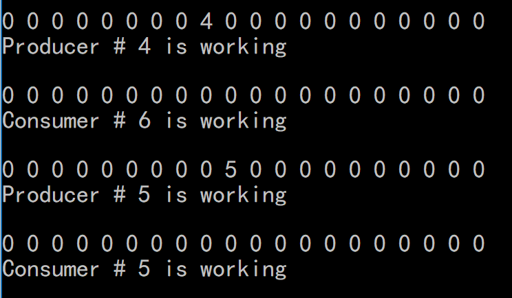

# 生产者&消费者问题模拟

#### Author：1551719 张文喆

## 1. 问题背景

线程同步中的生产者-消费者问题，这里规定每个线程进行读或写10次。

## 2. 运行环境

- 操作系统：Ubuntu 16.04.4 LTS
- 语言：C
- 编译器：gcc (Ubuntu 5.4.0-6ubuntu1~16.04.9) 5.4.0 20160609

## 3. 信号量

1. mutex：buffer锁，init=1
2. empty：buffer中的空区域，init=buffer_size
3. full：buffer中的满区域，init=0
4. producer_main_mutex：生产者线程数量锁，init=producer_num
5. consumer_main_mutex：消费者线程数量锁，init=consumer_num

## 4. 函数

1. void* producer(void* para)  // 生产者
2. void* consumer(void* para)  // 消费者
3. void printAll(const int No)  // 打印buffer

## 5. 运行机制

线程之间的同步使用信号量机制解决，具体方法可参考教材，在此简要说明：

1. buffer区域的读写权唯一，也即在同一时间，仅允许单一线程进行读或写（依靠mutex信号量实现）
2. 在buffer已满的情况下，producer不允许向buffer中生产内容（依靠empty信号量实现 ）
3. 在buffer为空的情况下，consumer不允许从buffer中读取内容（依靠full信号量实现）

## 6. 主线程-子线程关系处理

由于需要同时开启多个线程，所以不能使用pthread_join方法，否则会造成阻塞，只有当第一个线程运行完毕，第二个线程才能被创建，而这不符合我们的初衷。

```c
for(int i=1; i<=producer_num; ++i)
	{
		pthread_t tid;
		pthread_create(&tid, NULL, producer, (void*)i);
		pthread_join(tid, NULL);
	}
```

以上代码便会造成类似的阻塞。

如果不进行处理，只是用pthread_create方法，会导致在主线程结束时，所有子线程都被杀死，即使它们还没有正常退出。为此，我设计了producer_main_mutex, consumer_main_mutex两个信号量，用于阻塞main函数，使主线程在子线程运行完毕后才能结束。

具体实现如下：

```c
if(consumer_num < producer_num)
	for(int i=0; i<consumer_num; ++i)
		sem_wait(&consumer_main_mutex);
else if(consumer_num > producer_num)
	for(int i=0; i<producer_num; ++i)
		sem_wait(&producer_main_mutex);
else
	for(int i=0; i<consumer_num; ++i)
	{
		sem_wait(&consumer_main_mutex);
		sem_wait(&producer_main_mutex);
	}
```

之所以对producer和consumer线程的数目进行讨论，是为了防止这种情况：当consumer线程数量多于producer线程数量时，所有producer线程结束运行后，仍有consumer线程未结束，但此时buffer为空，这就造成了永久堵塞；反过来，当producer线程数量多于consumer线程数量时，也会有类似的情况，只不过由于buffer初始为空，所以在这种情况下更加宽容一些。

针对上面这两种情况，我的解决方法是：当consumer线程数量多于producer线程数量时，只要所有producer线程运行结束，主线程也就结束，剩余的consumer线程全部被杀死（靠producer_main_mutex信号量实现）；反之亦然（靠consumer_main_mutex信号量实现）。只有当consumer线程数量与producer线程数量相等时，主线程才会等待两组线程都结束后结束。

## 7. 运行方法

1. 在命令行参数中指定各项参数

   

   第一个参数为producer的数量，第二个参数为consumer的数量，第三个参数为buffer的大小。

2. 观察运行结果

   

   其中，数字代表buffer中的情况。在上图中，依次发生的情况为：4号producer向buffer中生产了一个数字4，6号consumer取走了这个4；5号producer向buffer中生产了一个数字5，5号consumer取走了这个5。由于每个线程为每隔1秒运行一次，且所有子线程几乎同时启动，所以会产生有趣的“呼吸”现象。