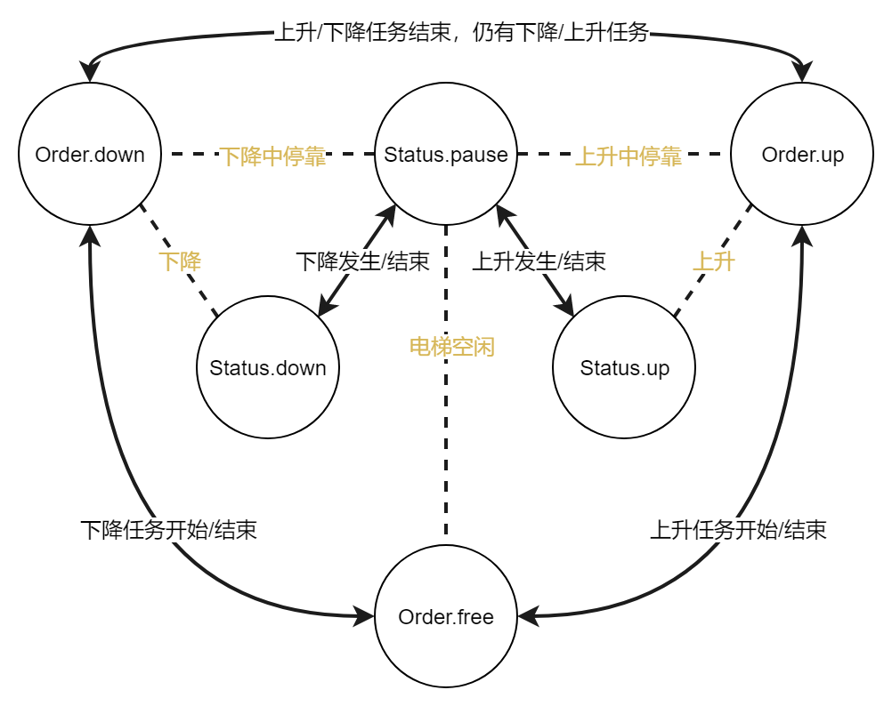
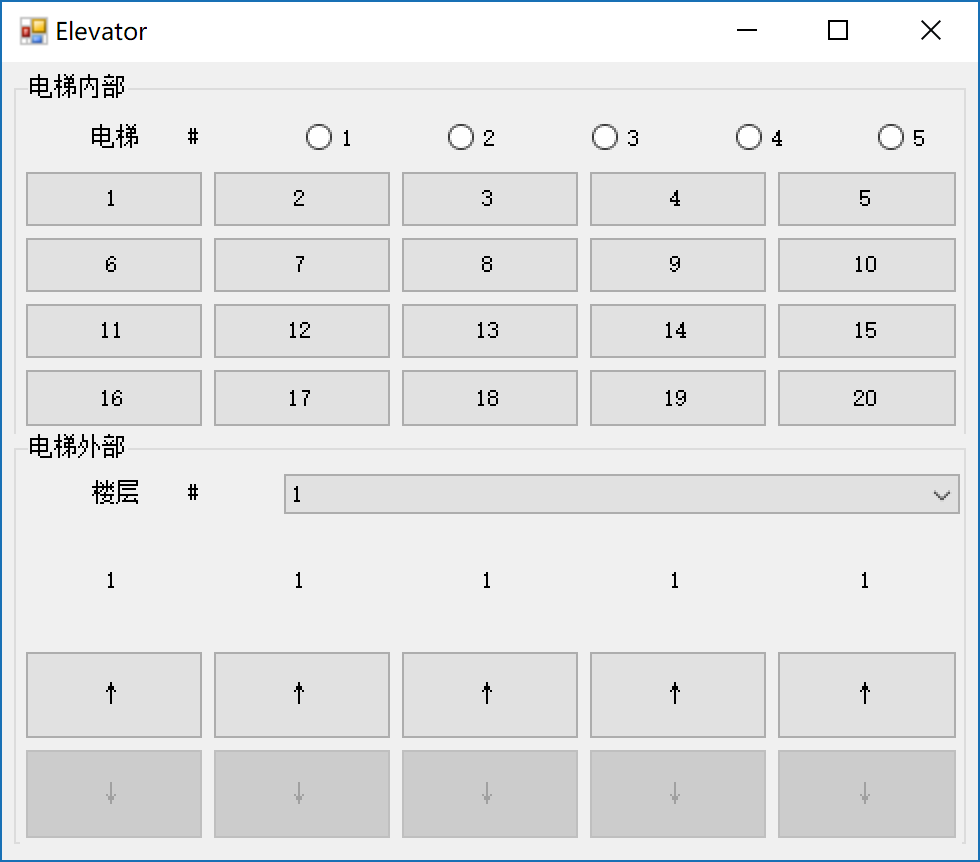
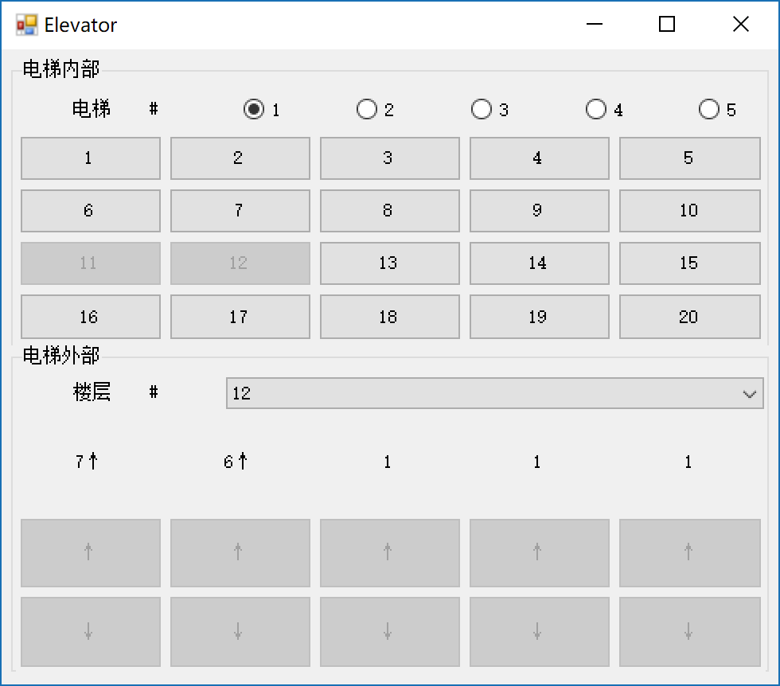
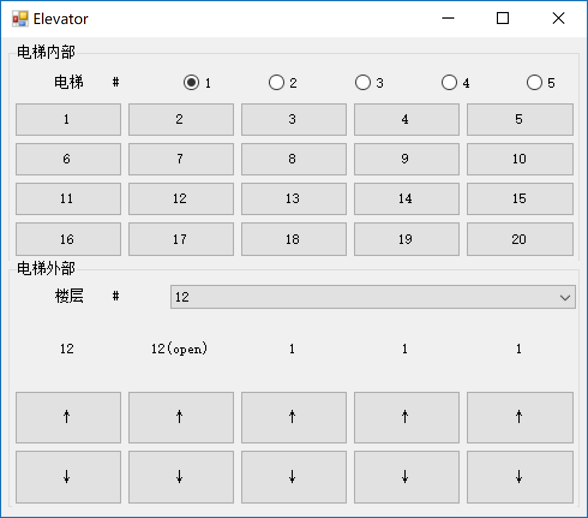

# 电梯调度

操作系统 课程作业1

#### Author：张文喆 1551719

## 项目背景

1. 20层楼，每层楼有向上/向下的按钮
2. 5部电梯，每部电梯内有1~20层楼的按钮

## 开发/运行环境

- 开发环境：Windows10 Pro RS3
- 开发语言：C# 6.0/ .net Framework 4.6

## 项目设计简述

### 1. 项目架构

elevator2.0

- 界面
  - 电梯内部
    - 20个楼层按钮
  - 电梯外部
    - 上升按钮
    - 下降按钮
    - 楼层及电梯状态展示标签
- 调度算法
  - 内部调度算法
  - 外部调度算法
    - 任务分配
    - 等待队列

### 2. 电梯状态图



电梯对象中，有两个枚举型变量status和order，它们的组合被用来表示电梯的状态。

图中的每个圆圈代表枚举变量的取值，黄色文字代表状态（status和order的组合），黑色文字代表状态转移条件。

### 3. 状态转移说明

1. status参数表明了电梯的当前的运行状态，有三种取值：pause（停靠），up（上升），down（下降）
2. order参数表明了电梯当前接受的指令，也有三种取值：free（无指令），up（上升），down（下降）

在电梯由1楼上升到20楼的过程中，电梯的运行状态（status）可能会一直变化（pause->up->pause->...），但电梯的指令（order）会一直保持不变（order=Order.up）。

不同的status参数不能随意地与order参数组合，事实上只有一部分组合是有效的。参照状态图，我们可以假设一部电梯的初始状态status=Statue.pause & order=Order.free，那么它的状态为“电梯空闲”；电梯上升时，status将转移至Status.up，order将转移至Order.up，此时电梯的状态变为“上升”；在上升的过程中，电梯可能会停靠，那么status转移至Status.pause，电梯处于“上升中停靠”状态；停靠之后，电梯可能继续上升，那么status回到Status.up。电梯下降时的状态转移是类似的。当电梯所有的任务都已完成，它将回到“电梯空闲”状态，状态转移过程遵循状态图中的路径。

除了简单的上升和下降，还存在一种特殊情况：当电梯上升时在某一层停靠（上升中停靠），之后电梯发现它已经没有需要上升的作业了，但它还有需要下降的任务，那么此时电梯的order将转移至Order.down（下降中停靠），status也转移至Status.down（下降）。注意，当电梯处于上升状态时，在所有需要上升的任务完成之前，电梯是不会响应下降的任务的。反之亦然。

另外，电梯的状态是不会由Status.up直接转换为Status.down的（或者反过来），这符合我们的生活常识：一部正在上升的电梯不会不停靠而直接变为下降的。

### 4. 调度说明

由于电梯任务的来源分为电梯内部和电梯外部，调度也因此被分为内部调度和外部调度。

1. 内部调度

   内部调度没有特殊的调度过程和算法，当电梯内部的楼层按钮被按下时，该任务即被送入此电梯的任务库中，等待被完成。

2. 外部调度

   外部调度较为复杂，总体上来看，外部调度时通过计算电梯与外部请求发生的楼层距离，选择合理的、距离最近的电梯响应请求。如果所有的电梯都不是“合理的”，那么该请求被送入等待队列。

### 5. 外部调度详解

根据状态转移图，将电梯分为3类：

1. 空闲电梯（“电梯空闲”状态）
2. 上升电梯（“上升”状态和“上升中停靠”状态）
3. 下降电梯（“下降”状态和“下降中停靠”状态）

当外部请求发生时，调度算法将根据请求发生的楼层和请求的方向（向上或向下）从上面的三种状态的电梯中选择两种，从里面进行挑选。其中，“空闲电梯”是会一直被选中的，剩下一种要根据请求的方向确定，上升的请求就选中“上升电梯”，下降的请求就选中“下降电梯”。

调度算法将从这两种被选中的电梯中选择与请求发生的楼层距离最近的电梯响应该请求，但有些细节应当考虑：如果一部电梯为“空闲电梯”，那么这部电梯可以响应发生在所有楼层的请求，不论此楼层是比该电梯当前楼层高还是低；但“上升电梯”不能响应在比它当前楼层低的楼层发生的请求，比如一部上升电梯正处于10楼，此时6楼发生了一个上升请求，那么这部电梯不应当响应这个请求；“下降电梯”也是同理。

除此之外，还有一种常见但难以处理的情况：假设4部电梯处于1楼，为“电梯空闲”状态，1部电梯响应发生在10楼的下降请求，已经上升到了6楼；此时有人在11楼发出上升请求，那么根据现有的调度算法，这部正在上升的电梯应当响应11楼的请求，但这是不合理的：10楼的人要下降，11楼的人要上升，如果同一部电梯响应了这两个请求，那么必然产生矛盾。为此，我选择维护两张表格，分布用于记录哪部电梯响应了哪一层的上升或下降请求，在分配任务之前，调度系统要查询与请求的方向相反的那张表格，保证这部电梯不存在于该表格中，才能为其分配该任务。例如，若电梯存在于上升的任务表格中，那么它将不能响应下降的请求。

特殊情况：当请求发生的楼层恰好有一部电梯，那么当这部电梯满足以下两个条件的一个时，它将响应该请求，立刻开门：

1. 电梯空闲（Status.pause，Order.free）
2. 电梯处于停靠状态（Status.pause），并且电梯的order与请求的方向一致

以上这些设计会导致一个问题：可能存在面对一个请求，所有电梯都无法响应该请求的情况。例如，当所有电梯都处于15楼，并且状态为“上升”，那么此时若有人在10楼按动按钮（不论上下）发出请求，每一部电梯都不应当响应此请求。在这种请求无法被立即响应的情况下，我们将该请求放入等待队列，并且要求调度系统每隔一定的时间去检查等待队列，尝试为其中的任务调度合适的电梯。一旦被分配出去，该请求就被从等待队列中移除。

*注：虽然名为“等待队列”，但实际上并不要求等待的请求“先进先出”，这里只是借用了“等待队列”这个名字。*

总结一下，外部调度算法包含以下几点：

1. 就近原则：优选选择距离最近的的电梯
2. 上升请求可以挑选空闲电梯（Order.free）和上升电梯（Order.up），下降请求可以挑选空闲电梯（Order.free）和下降电梯（Order.down）
3. 上升电梯不能响应比电梯当前楼层低的上升请求，下降电梯不能响应比电梯当前楼层高的下降请求
4. 正在响应下降请求的上升电梯不能响应任何上升请求，正在响应上升请求的下降电梯不能响应任何下降请求
5. 不能处理的请求将被加入等待队列，定时检查和清理

## 6. 实现细节

### 1. 记录状态的表格

在C#中，我选择使用**Dictionary**记录具有对应关系的对象和状态，例如

```C#
public static Dictionary<int, bool> levelUp = new Dictionary<int, bool>();  // 记录向上的楼层按钮按下状态
public static Dictionary<int, bool> levelDown = new Dictionary<int, bool>();  // 记录向下的楼层按钮按下状态
public static Dictionary<int, Elevator> elevatorGroup = new Dictionary<int, Elevator>();  // 记录电梯对象
public static Dictionary<int, int> whoDealTheUpRequest = new Dictionary<int, int>();  // 记录哪部电梯响应了哪个上升任务
public static Dictionary<int, int> whoDealTheDownRequest = new Dictionary<int, int>();  // 记录哪部电梯响应了哪个下降任务
```

其中，前三个Dictionary对象的大小都是固定的，因为楼层为20层，电梯为5部（这些数值被定义为常量，可以按需修改，但窗体设计也应随之改变）；后两个用于记录任务的分配情况，其大小是动态变化的。

```C#
public static List<Job> requestWait = new List<Job>();  // 记录未能处理的任务
public struct Job  // 外部请求任务的结构体
        {
            public int requestLevel;
            public bool wantUp;
            public bool hasFinished;
        };
```

这是我为等待队列设计的任务结构体及其实现，可以看到“任务队列”其实是一个List，它的读取是自由的。

### 2. 电梯对象

电梯类主要记录了电梯的各种信息及状态，为了更好地模拟操作系统调度，除了初始化函数，电梯类没有任何成员函数。

```C#
/*电梯对象*/
public class Elevator  // 电梯PCB
{
    public Status status = Status.pause;
    public Order order = Order.free;

	//电梯内按键
	public Dictionary<int, bool> destination = new Dictionary<int, bool>();
	public int currentFloor = 1; //当前楼层，初始为1楼
	public int no; //电梯编号
    
    public Elevator(int elevatorNo)
    {
    	for(int i=1; i<=LEVEL_NUM; ++i)
        	destination.Add(i, false);

        no = elevatorNo;
    }
}
```

### 3. Timer

在我的设计中，电梯的速度为1层/秒，其开关门时间也为1秒，所以显然，我们需要每隔一秒去检查电梯的状态，更新其各项数值（如果有必要的话）。为此，我选择使用**System.Windows.Forms.Timer**，这是一个.net Framework控件，其作用为每隔一段时间执行一次Timer事件。为了对应我的设计，我将其Interval变量设为1000（单位：毫秒），其作用为更新对应的电梯楼层信息，进行状态转移，更新按钮状态。显然，5部电梯对应5个Timer对象。详见代码222~249行。

除此之外，为了实现之前描述的定期检查等待队列的功能，我还添加了一个Timer对象，专门用于每隔0.5秒检查等待队列，并尝试为其中的请求进行分配。在此不多赘述，详见代码251~264行。

### 4. 调度实现

内部调度不必多说，而外部调度比较复杂。为了筛选出合适的候选电梯，我们要进行以下三项的判断：

1. 电梯的order
2. 请求的方向
3. 电梯是否存在于与请求方向相反的任务记录表格中。

只有这三项满足了一定的条件，调度系统才会把这部电梯列为候选电梯。具体判断条件详见代码357~370行。

找出候选电梯之后，调度系统会根据电梯与请求发生的楼层间的距离，选出最合适的电梯。具体操作时还要考虑楼层差的正负问题，详见代码372~376行。

### 5. 状态转移

之前提到的5个Timer对象会调用状态转移函数。由于状态转移的同时往往伴随着各种信息和按钮状态的更新，我将状态更新函数也合并到里面了，详见代码267~323行。

## 函数速查

|                            函数名                            |                             作用                             |  位置   |
| :----------------------------------------------------------: | :----------------------------------------------------------: | :-----: |
|                 void renew_outside_button()                  |                     更新电梯外部按钮状态                     | 105~134 |
|                  void renew_inside_button()                  |                     更新电梯内部按钮状态                     | 136~148 |
|           void renew_elevator_label(int currentNo)           |                         更新电梯标签                         | 157~169 |
|     void timerElevator_Tick(object sender, EventArgs e)      |                 时钟控件，每间隔1秒运行一次                  | 222~249 |
|   void timerExtraDispatch_Tick(object sender, EventArgs e)   | 时钟控件，检查等待队列，尝试为等待队列中的任务分配电梯，每隔0.5秒运行一次 | 251~264 |
|        void check_go_ahead(Elevator currentElevator)         |                   停靠之后检查是否需要继续                   | 267~281 |
|          void check_pause(Elevator currentElevator)          |                   检查当前楼层是否需要停靠                   | 316~323 |
| async void add_mission(Elevator currentElevator, int destinationLevel) |                   内部请求调度（分发任务）                   | 326~346 |
|      async void dispatch(int requestLevel, bool wantUp)      |                         外部请求调度                         | 348~424 |

## 7. 使用演示

初始状态：外部视角位于1楼，内部视角处于1号电梯内，所有电梯均处于1楼。由于1楼不能向下，所以1楼的下降按钮是不可选中的。



运行时，外部请求会被转化为内部请求，并在电梯内部按钮上体现出来，下图中的11楼按钮的冻结状态为内部请求结果，12楼按钮的冻结状态为外部请求结果。当外部请求被完成之前，外部按钮也处于冻结状态。



当电梯到达指定的楼层，会显示open，代表电梯开门；满足条件的冻结的按钮也会被重新激活。



此外，当切换电梯或者楼层时，相应的按钮状态也会发生改变，以表现不同电梯或不同楼层的情况。在此不再赘述。